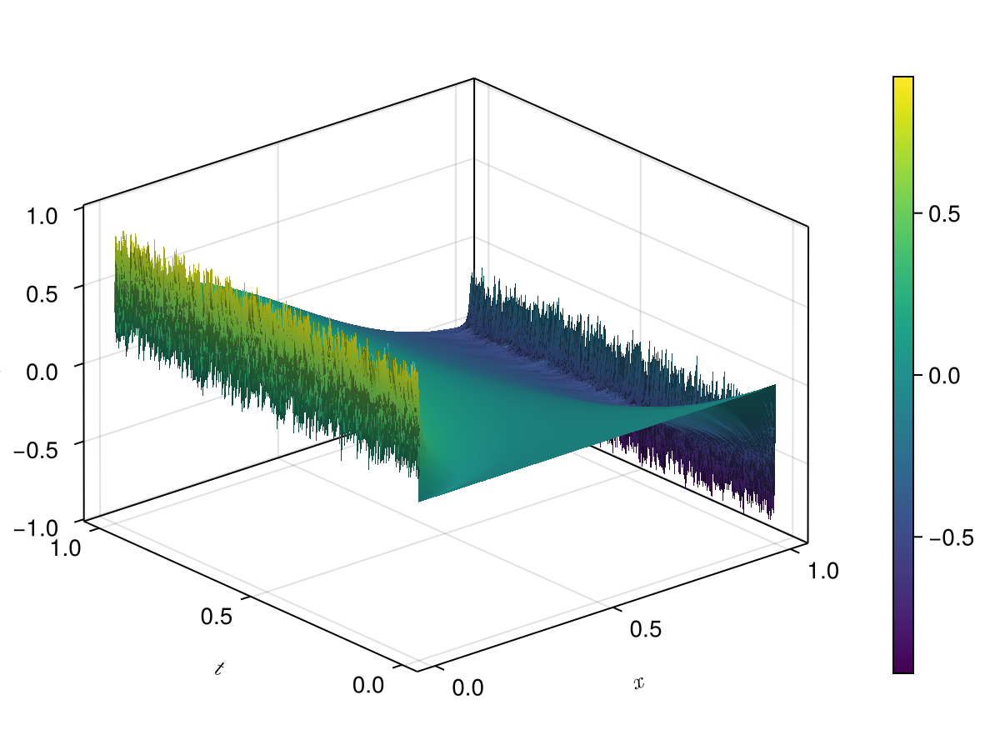
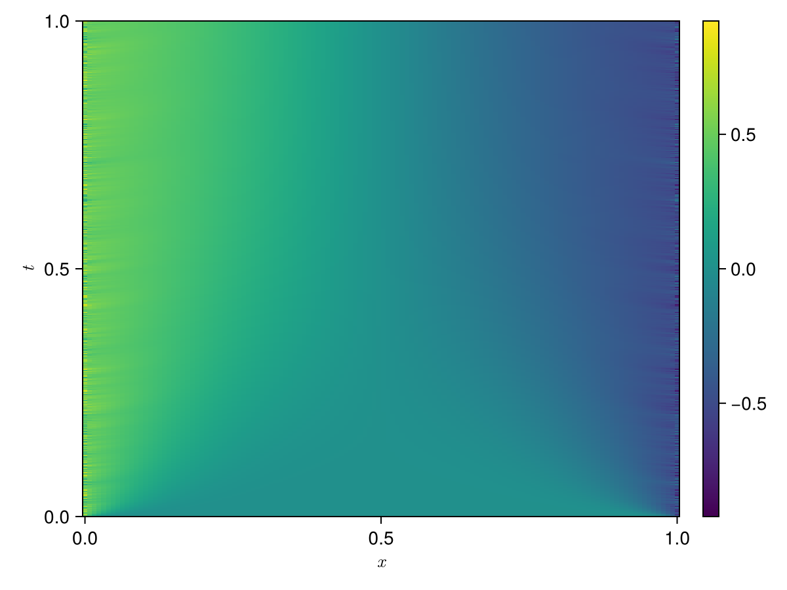
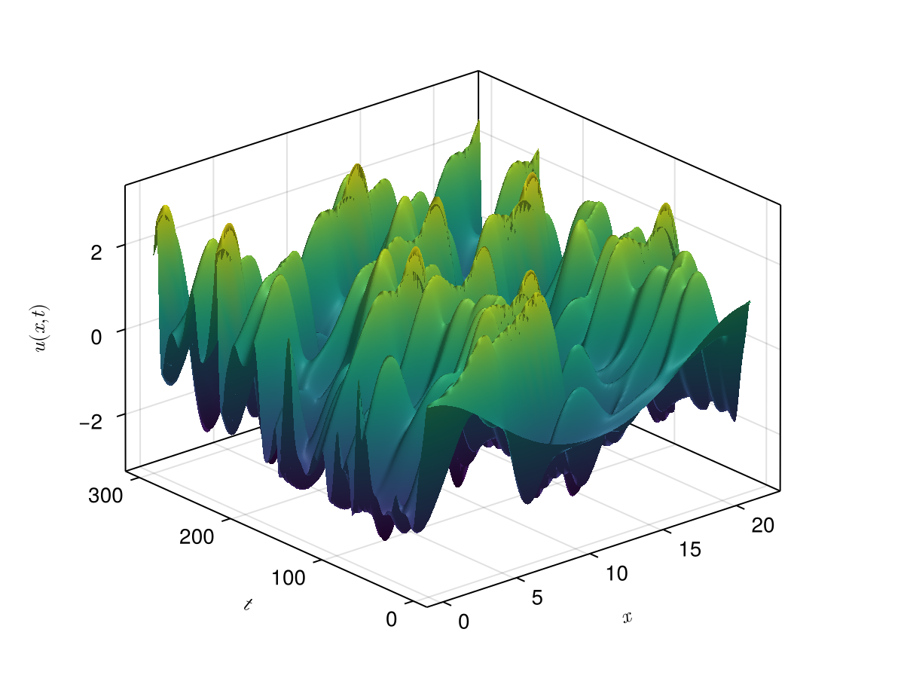
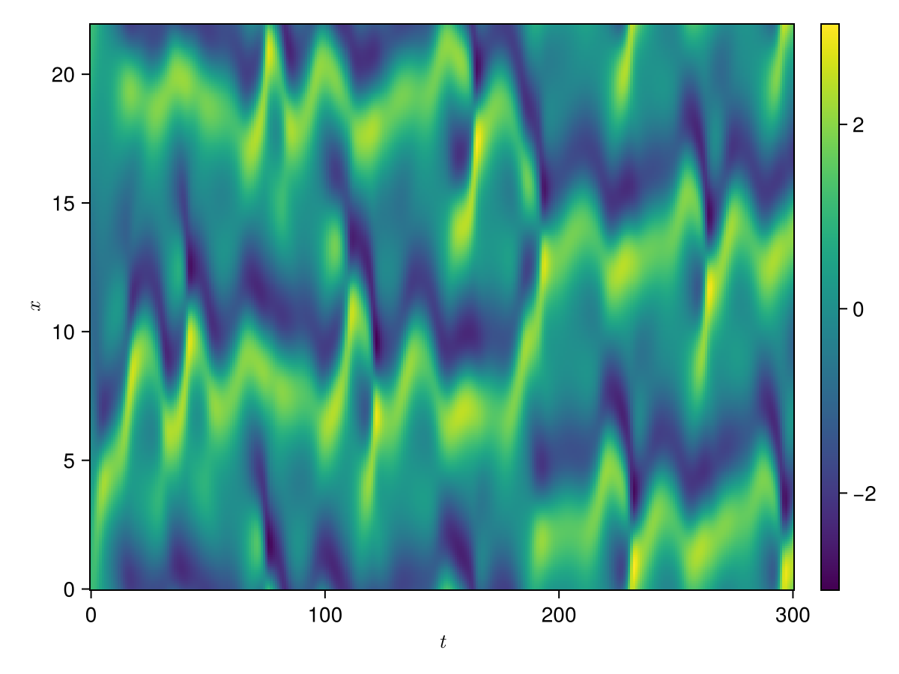

<h1 align="center">
  
</h1>

# Polynomial Model Reduction Dataset
This GitHub repo includes various polynomial structured ordinary differential equations (ODEs) models and its dataset derived from large-scale partial differential equations (PDEs).
The polynomial models are defined by

$$
\dot{x}(t) = Ax(t) + H(x(t) \otimes x(t)) + G(x(t) \otimes x(t) \otimes x(t)) + Bu(t)
$$

where 
- $x \in \mathbb{R}^n$: state variable vector
- $u \in \mathbb{R}^m$: control input vector
- $A \in \mathbb{R}^{n \times n}$: linear system matrix
- $H \in \mathbb{R}^{n \times n^2}$: quadratic system matrix
- $G \in \mathbb{R}^{n \times n^3}$: cubic system matrix 
- $B \in \mathbb{R}^{n \times m}$: control/input matrix
- $\otimes$: Kronecker product

We call the $A,~F,~H,~B$ matrices the operators of the system, and these operators are constructed using mainly finite difference scheme.
This package constructs these operators for a given set of parameters and allows you to numerically integrate the system to collect the solution data for PDEs.
The main goal of this package is to accelerate the development of novel model reduction approaches by making these models and dataset available to everyone.

## Currently Offered Models

| Model | Equation | Boundary Conditions |
| --- | --- | --- |
| 1D Heat | $u_t = \mu u_{xx}$ | periodic, Dirichlet |
| Viscous Burgers' | $u_t = \mu u_{xx} - uu_{x}$ | periodic, Dirichlet | 
| FitzHugh-Nagumo | $$\begin{align} u_t &=  \epsilon^2 u_{xx} + u(u-0.1)(1-u) - v + g \\ v_t &= hu + \gamma v + g \end{align} $$ | [Dirichlet and Neumann](https://morwiki.mpi-magdeburg.mpg.de/morwiki/index.php/FitzHugh-Nagumo_System) |
| Fisher-KPP | $u_t = D u_{xx} + ru(1-u)$ | periodic, Dirichlet, Dirichlet and Neumann (mixed) | 
| Allen-Cahn | $u_t = \mu u_{xx} - \epsilon(u - u^3)$ | periodic, Dirichlet, Dirichlet and Neumann (mixed) |
| Kuramoto-Sivashinsky | $u_t = -\mu u_{xxxx} - u_{xx} - uu_x$ | periodic |
| Modified Korteweg-de Vries | $u_t = -\alpha u_{xxx} - \beta u^2u_{xx}$ | periodic, Dirichlet |
| Modified Korteweg-de Vries-Burgers | $u_t = -\alpha u_{xxx} - \beta u^2u_{xx} + \gamma u_{xx}$ | periodic, Dirichlet |
| Gardner | $u_t = -\alpha u_{xxx} + \beta uu_{x} + \gamma u^2u_{x}$ | periodic, Dirichlet |
| Damping Gardner-Burgers' | $u_t = -\alpha u_{xxx} + \beta uu_x + \gamma u^2u_x + \delta u_{xx} + \epsilon u$ |  periodic, Dirichlet |
| 2D Heat | $u_t = \mu(u_{xx} + u_{yy})$ | Dirichlet |

## Gallery

### Viscous Burgers' Equation

  
&nbsp; &nbsp; &nbsp; &nbsp;
  

### Kuramoto-Sivashinsky Equation

  
&nbsp; &nbsp; &nbsp; &nbsp;
  

### 2D Heat Equation

  

## Non-Redundant Expressions

In this package, you will see a slightly different version of operators from what is defined above. Those are operators including only the non-redundant terms which eliminate the redundancy coming from the symmetry of Kronecker products. For ease of exposition, we will only introduce the non-redundant operators. For more info, please see [this page](https://smallpondtom.github.io/UniqueKronecker.jl/dev/matrices/dynamicalsystem/). 

For the quadratic and cubic operators we define the non-redundant counterparts as follows:

- $F \in \mathbb{R}^{n \times n(n+1)/2}$: quadratic operator corresponding to the non-redundant terms of $x \otimes x$
- $E \in \mathbb{R}^{n \times n(n+1)(n+2)/6}$: cubic operator corresponding to the non-redundant terms of $x \otimes x \otimes x$

Then, the ODE is defined by

$$
\dot{x}(t) = Ax(t) + F(x(t) \oslash x(t)) + E(x(t) \oslash x(t) \oslash x(t)) + Bu(t)
$$

where $\oslash$ is the __unique__ Kronecker product defined in [UniqueKronecker.jl](https://github.com/smallpondtom/UniqueKronecker.jl).

## Contributing

Contributions are welcome! If you find a bug or have a feature request, please open an issue. If you'd like to contribute code, feel free to submit a pull request.

## License

This project is licensed under the [MIT License](https://github.com/smallpondtom/PolynomialModelReductionDataset.jl/blob/main/LICENSE).

